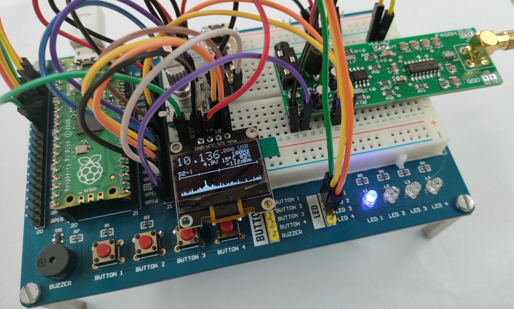
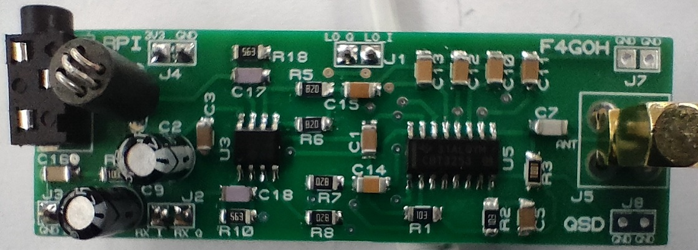
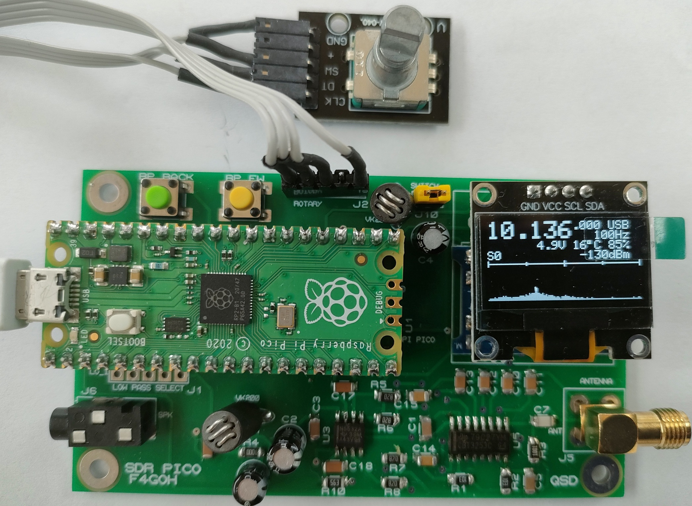
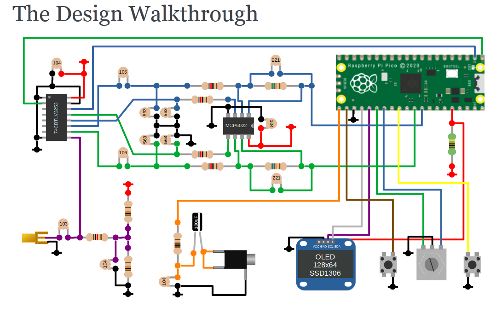
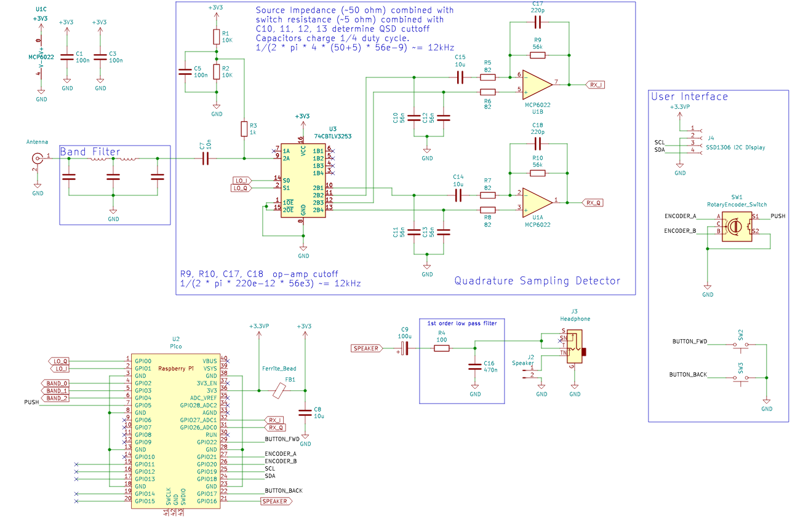
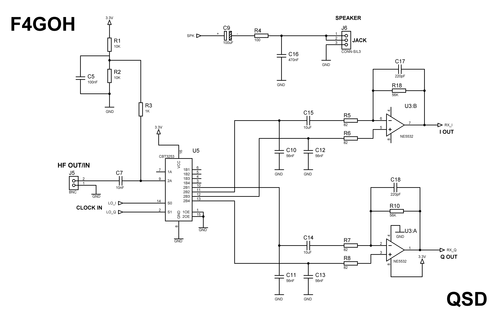
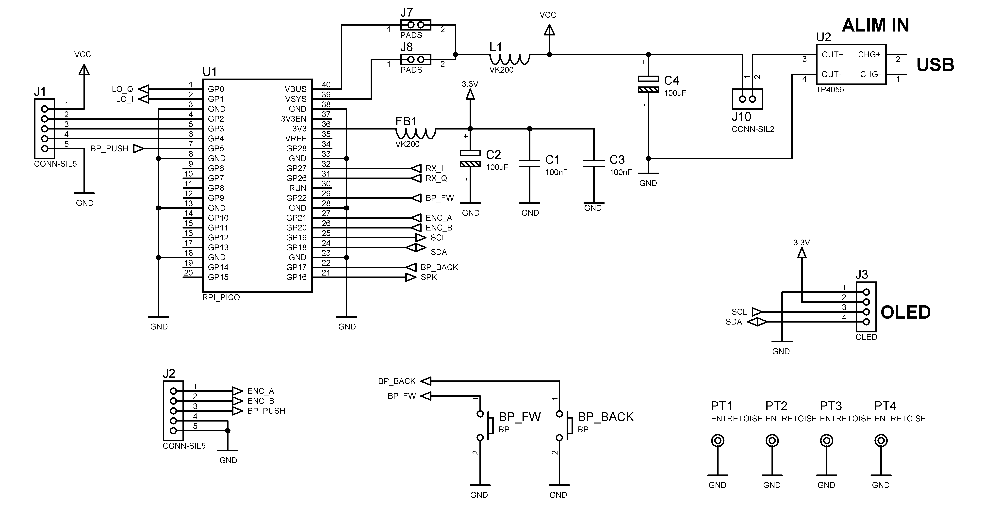
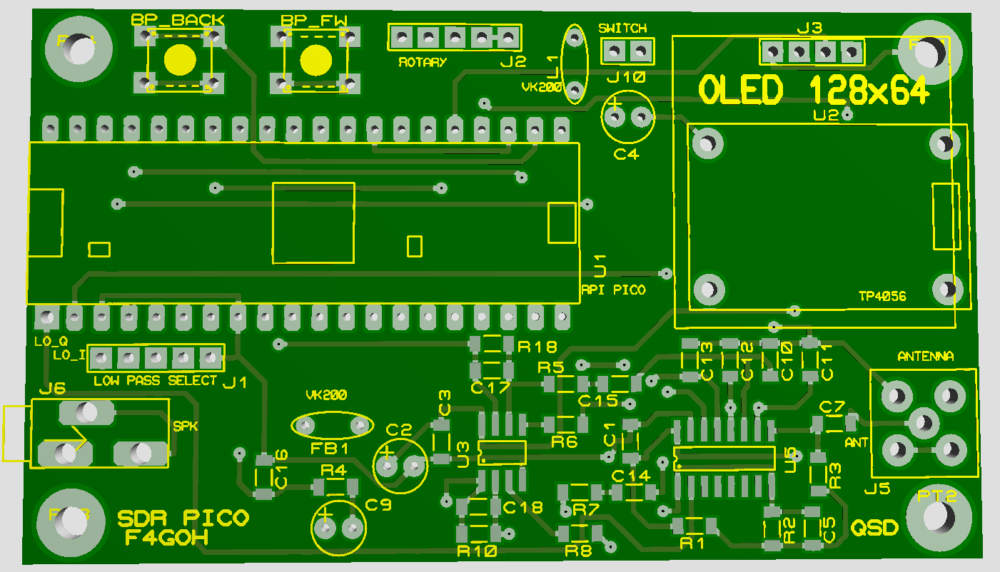
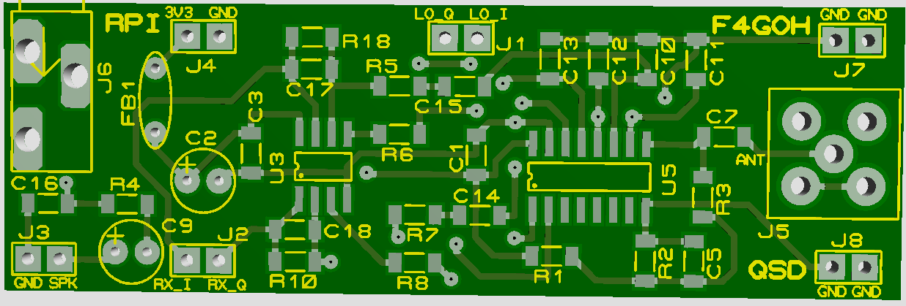
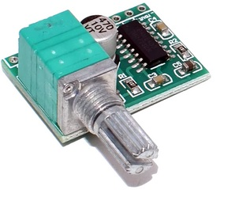

# SDR-PICO

[A project created by Jon Dawson](https://github.com/dawsonjon/PicoRX)

[Printed circuit boards and test made with the help of **jeff F5BCB**](https://www.qrz.com/db/F5BCB)

**What's new about Jon's version?**

This is a new version of the printed circuit board for high school and university students.

An HF SDR (Software-Defined Radio) receiver based on a Raspberry Pi Pico and a Tayloe Detector (or QSD detector: quadrature sampling detector) offers several advantages for the reception of high-frequency radio signals. The low-cost, compact Raspberry Pi Pico provides sufficient computing power to process signals in real time and run digital filtering algorithms. The Tayloe detector, on the other hand, works as a direct conversion mixer by sampling the signals in quadrature, which simplifies the hardware architecture while ensuring accurate conversion of HF signals into audio signals. This configuration makes it possible to build a low-cost SDR receiver for HF reception enthusiasts and electronics learning projects.

# SDR-PICO on a breadboard with QSD module

# QSD module on the breadboard

# Raspberry Pi Pico Specifications

## Core Features
- **Microcontroller**: RP2040, designed by Raspberry Pi
- **Processor**: Dual-core ARM Cortex-M0+ running at up to 133 MHz
- **Memory**: 264 KB of SRAM and 2 MB of on-board QSPI Flash storage
- **USB**: USB 1.1 with device and host support

## GPIO and Connectivity
- **GPIO Pins**: 26 multi-function GPIO pins, including:
  - 2 × SPI, 2 × I2C, 2 × UART, 3 × 12-bit ADC, and 16 × PWM channels
- **Programmable I/O (PIO)**: 2 PIO blocks, each with 4 state machines for custom peripheral support
- **Debugging**: SWD debug pins available

## Power and Input
- **Operating Voltage**: 3.3V (régulator via micro-USB or external power source)
- **Low Power Consumption**: Power-efficient design with various sleep and dormant modes

## Software and Compatibility
- **Supported Languages**: C/C++ and MicroPython
- **Development Environment**: Official support for the Raspberry Pi Pico SDK, including integration with the Visual Studio Code (VS Code) IDE

## SDR RX Features
- **Dual RX firmware for raspberry PI PICO (picorx.uf2) and raspberry PI PICO 2 (pico2rx.uf2)**
- **Rotary encoder**
- **SSD1306 OLED display**
- **Jack3.5 audio output**
- **50mA consumption**
- [**PAM8403 audio amplifier**](https://fr.aliexpress.com/item/1005001689998894.html)

# SDR-PICO on a single board

# The concept

## Schematics

## PCB

##PAM8403 audio amplifier

## Usefull links

- [simple pico sdr](https://101-things.readthedocs.io/en/latest/breadboard_radio.html)

- [Complete with hf filter](https://101-things.readthedocs.io/en/latest/radio_receiver.html)

- [Github main project](https://github.com/dawsonjon/PicoRX)

