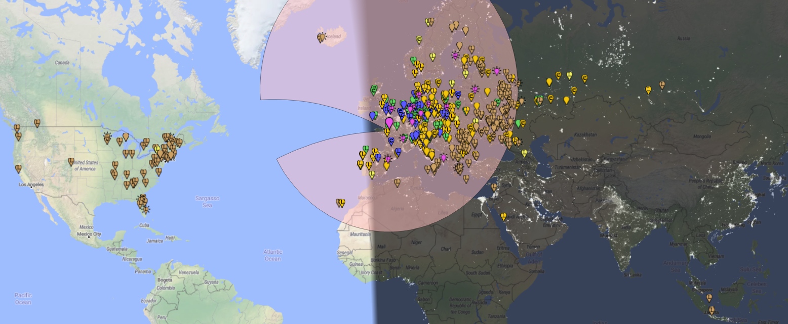
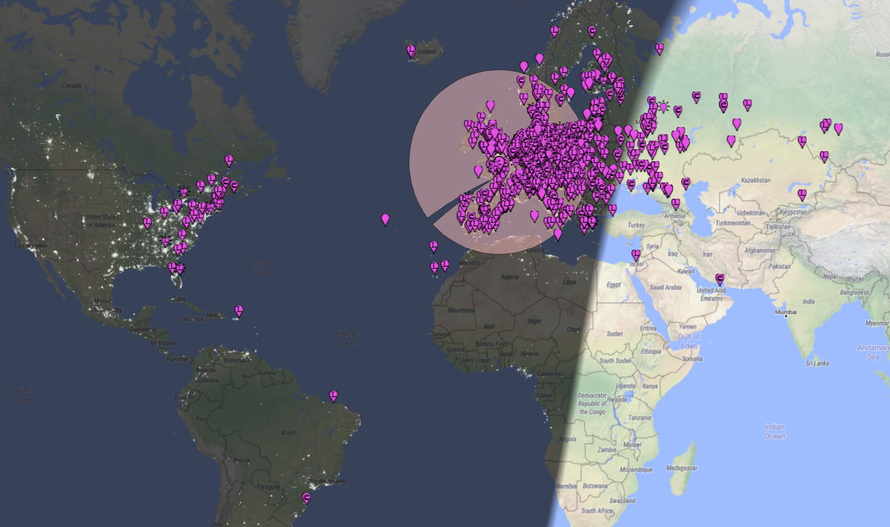
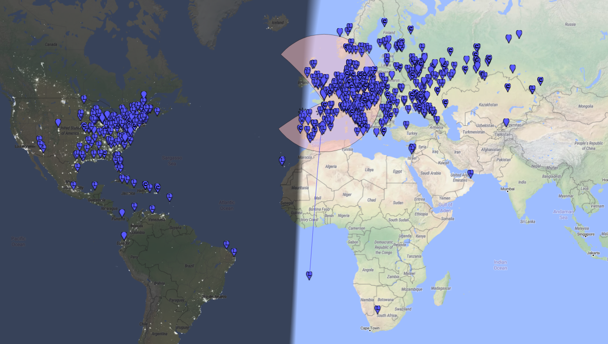
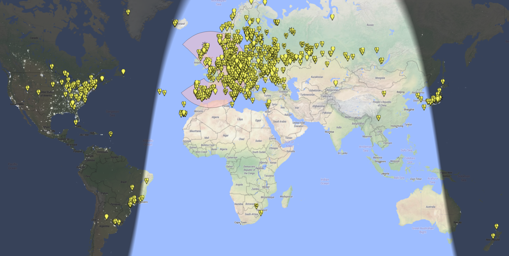

# Résults

# Decode FT8

# 80m

# 40m

# 17m

# Waterfall with ILI9341-based TFT display (Right clic, Save link target as)

[view the video file](https://github.com/f4goh/SDR-PICO/blob/main/results/test_waterfall.mp4)

# audio file (Right clic, Save link target as)

[Listen to the audio file](https://github.com/f4goh/SDR-PICO/blob/main/results/phone40m.mp3)

